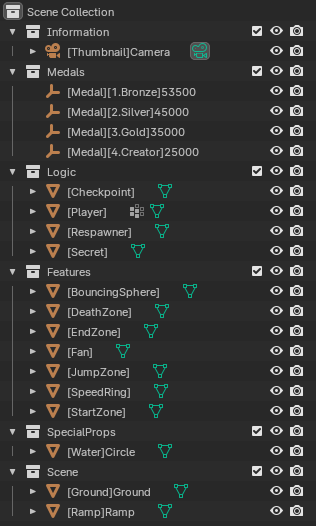

# Make a map for Hoverflow

## Installation

1. Download the latest version of [Blender](https://www.blender.org/download/)
2. Install Blender with the .exe file you just downloaded
2. Download the file [hoverflow-map-template.blend](hoverflow-map-template.blend) from this repository
3. Double click the Blender file to open it in Blender

## Template

When opening the template, you should see on the right panel :
- Multiple collections like Information, Medals and Logic (with the white box icon)
- Objects within those collections, represented by an orange icon
    - Camera icon is a camera
    - The axis icon is an empty object
    - The triangle icon is a 3D mesh

## Tags

Tags between brackets like this [ ] will tell Hoverflow what are the associated objects. Here is the list of tags you can use to build your levels :

### Medals

You can set directly the medals time in Blender using the **Medals** collection. 

**Important:** Times associated to each medals are in milliseconds. In the following example the bronze medal value is 53250, meaning you would have to less than 53 seconds and 250 milliseconds to obtain the bronze medal in Hoverflow.

To set a medal time :
1. Double click on the object in the hierarchy
2. Set a value after the tags (must be integers)

**Important:** Make sure your medals times are correctly ordered :
- Bronze time is higher than silver
- Silver time is higher than gold
- Gold time is higher than creator

### Logic

Objects in the **Logic** collection are required for Hoverflow levels to work properly :

* The **[Player]** is the spawn (3D Model is at 1/1 scale)
* The **[Respawn]** is the first respawn location
* The **[StartZone]** is the object from which the player must exit for the timer to start (make sure the [Player] is inside this object !)
* The **[EndZone]** is the trigger the player must touch to finish the level

### Features

The **Features** collection allows you to use all the features Hoverflow offers. I advise you to keep the scales as they are (except death zones) since they already are at a 1/1 scale.

* The **[Checkpoint]** sets a checkpoint (you can place several)
* The **[Secret]** object is a limbo key (you can place several) if you want to add collectibles to the map (keep in mind it won't add to your Pilgrimage count)
* **[DeathZone]** makes the player respawn when touched (place as many as you want, and scale it as you want)
* **[BouncingSphere]** will place a white bouncing sphere 
* **[Fan]** will place an air funnel 
* **[SpeedRing]** will place a speed ring 
* **[JumpZone]** will place a jump zone 
* **[SpeedRing]** will place a speed ring 

### Special props

I added a **SpecialProps** collection if you want to use some Hoverflow classic assets :
* The **[Water]** object will be replaced by the water used in Hoverflow's chapter 2

More will be added.

### Scene

Place all you meshes inside this collection !

You can use special tags to any object to indicate how it behaves :
* Any mesh with the **[Ramp]** tag will be surfable
* Any mesh with the **[Ground]** tag will be walkable, slidable, jumpable

**Note:** You are not limited by the classic surf angles, if you want to make a cube, a sphere or even an elephant surfable, you can !

## Testing

### Exporting as glTF

To test your map, you need to export it from Blender as a glTF file.
1. In Blender, select **File > Export > glTF 2.0** in the top left menu
2. In the right panel of the new pop-up, click **Include** to unfold the menu
3. Select **Limit to > Visible Objects** to only export active objects
4. Select **Data > Cameras** to export the thumbnail camera
5. Select the folder you want to export to
5. Click **Export glTF 2.0**

### Opening it in Hoverflow

1. Go the main menu of Hoverflow
2. Click **CUSTOM MAP** then **LOCAL FILE**
3. Select the glTF file you just exported

### Reloading the map while playing

If you want to test changes you just made in Blender :

1. Export the map to glTF again in Blender
2. Open the menu by pressing **Escape**
2. Click on **RELOAD**

## Publish to Steam Workshop

When you are happy with your map and you tested it thoroughly, you can publish it to the [Hoverflow Workshop](https://steamcommunity.com/workshop/browse/?appid=1280060).

1. [Open your file in Hoverflow](#opening-it-in-hoverflow)
1. Open the menu with Esc
1. Enter a name for your level
1. Click on **PUBLISH**
1. If this is your first time publishing on the Workshop, the Steam Terms of Service page should appear, and you have to agree for your item to be visible in the workshop

**Important:** After publishing for the 1st time your map, a **\<file-name\>.json** file is created, do not lose it and keep it with the same name as your **.glb** file ! It contains the Workshop ID associated to your **.glb** file and allows you to update your map !

## Updtating your map after publishing

If you want to update your map on the Steam Workshop after publishing it :

1. [Open your file in Hoverflow](#opening-it-in-hoverflow), it will automatically recognize your ID if you still have the **\<file-name\>.json** in the same directory
1. Open the menu with Esc
1. Update the name for your level if you want !
1. Click on **UPDATE**

**Important:** You can update the thumbnail, description, and more directly from the Workshop !

## Good practice

Here are so good practice in order to produce clean maps.
* Duplicate objects from the **Features** collection to place them in the Scene collection

## Example

You can download the file [hoverflow-map-example.blend](hoverflow-map-example.blend) to see a working example of a full map.

## Questions ?

If you have any question you can ask in the #mapping channel of the [Discord server](https://discord.gg/T2msJbZ4JY).