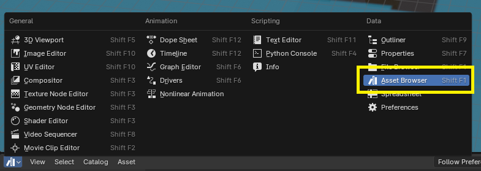
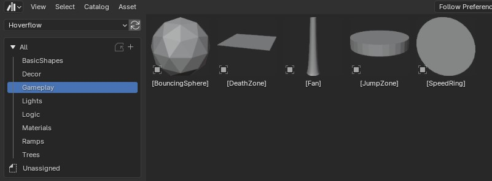

# Make a map for Hoverflow

## Installation

1. Download the latest version of [Blender](https://www.blender.org/download/)
1. Install Blender with the .exe file you just downloaded

## Adding the Hoverflow library

1. Download the [Hoverflow folder](library/Hoverflow) from this repository
1. In Blender click Edit > Preferences > File Paths > Click the "**+**" under Assets Librairies

1. Select the path to the Hoverflow folder you just downloaded
1. Click the **Clock icon** at the bottom left of the Blender screen 

1. Click on **Asset Browser**

1. Click on the **All** button and select **Hoverflow** to only access the game's assets

## Create a map

1. Download the file [hoverflow-map-template.blend](hoverflow-map-template.blend) from this repository
1. Double click the Blender file to open it in Blender

When opening the template, you should see on the right panel :
- Multiple collections like Information, Medals and Logic (with the white box icon)
- Objects within those collections, represented by an orange icon
    - Camera icon is a camera
    - The axis icon is an empty object
    - The triangle icon is a 3D mesh

### Tags

Tags between brackets like this [ ] are keywords that will add specific behaviours to these objects in Hoverflow.

### Medals

You can set directly the medals time in Blender using the **Medals** collection. 

**Important:** Times associated to each medals are in milliseconds. In the following example the bronze medal value is 53250, meaning you would have to less than 53 seconds and 250 milliseconds to obtain the bronze medal in Hoverflow.

To set a medal time :
1. Double click on the object in the hierarchy
1. Set a value after the tags (must be integers)

**Important:** Make sure your medals times are correctly ordered :
- Bronze time is higher than silver
- Silver time is higher than gold
- Gold time is higher than creator

### Logic

Objects in the **Logic** collection are rules for your Hoverflow level :

* The **[Player]** is the spawn (3D Model is at 1/1 scale)
* The **[Respawn]** is the first respawn location
* The **[StartZone]** is the object from which the player must exit for the timer to start (make sure the [Player] and [Respawn] are inside this object !)
* The **[Checkpoint]** sets a checkpoint (you can place several)
* The **[Secret]** object is a limbo key (you can place several) if you want to add collectibles to the map (keep in mind it won't add to your Pilgrimage count)
* The **[EndZone]** is the trigger the player must touch to finish the level

You can drag and drop items from the **Logic** catalog of your **Hoverflow** library :

### Gameplay

The **Gameplay** catalog allows you to use all the gameplay features Hoverflow offers. I advise you to keep the scales as they are (except death zones) since they already are at a 1/1 scale.

* **[BouncingSphere]** will place a white bouncing sphere 
* **[DeathZone]** makes the player respawn when touched (place as many as you want, and scale it as you want)
* **[Fan]** will place an air funnel
* **[JumpZone]** will place a jump zone, make sure it's anchored in a [Ground] mesh !
* **[SpeedRing]** will place a speed ring 

You can drag and drop items from the **Gameplay** catalog of your **Hoverflow** library :

### Ramps

The **Ramps** catalog allows you to use all the ramps I created for Hoverflow. You can even play with their scale and modify them in the **Edit Mode** of Blender !
You can drag and drop items from the **Ramps** catalog of your **Hoverflow** library :

You can also create your own ramps from scratch by modeling an object and simply adding the **[Ramp]** tag to the name of the object.

**Note:** You are not limited by the classic surf angles, if you want to make a sphere, a big pencil or even an elephant surfable, you can !

### Materials

Some Hoverflow materials can be used directly from the **Materials** catalog of the **Hoverflow** library. Simply drag and drop them on any object !

**Note:** The preview is not correct in Blender, they will be replaced by the true materials in Hoverflow.

### Lights

You can add 3 types of lights to your map :
- Sun : place maximum 1 on these, they are directional lights that will affect all of your map !
- Point : a point light with a maximum radius
- Spot : a spot light that will cast light in a specific area and direction

#### Change color, radius and intensity

You can change the color, radius and intensity of the lights by :
1. Selecting your light in the hierarchy
1. Opening the **Data** tab on the right (green bulb icon)
1. Modifying the **Color**, **Power** (**Strength** for Sun light) and **Distance** parameters

#### Visualize your lights

Press **W > Rendered** to check your lighting, this is an accurate preview of your lights intensity.

### Other catalogs

You will other catalogs in the **Hoverflow library** :
- The **Decor catalog** contains ready to use 3D meshes like water, dunes etc. You can add tags to these objects to make them surfable or walkable
- The **Vegetation catalog** contains ready to use trees and vines. Note that their name is between tag since they will replaced in Hoverflow, so you don't need to change their materials 
- The **Basic Shapes catalog** allows you to quickly prototype your map with basic meshes
- More will be added !

### Ground

Any mesh with the **[Ground]** tag will be walkable, slidable, jumpable ! If this tag is not present, the mesh will not have any collision.

## Testing

### Exporting as glTF

To test your map, you need to export it from Blender as a glTF file.
1. In Blender, select **File > Export > glTF 2.0** in the top left menu
1. Select **Remember Export Settings** to associate these settings to this file
1. Select **Include > Limit to > Visible Objects** to only export active objects
1. Select **Include > Data > Cameras** and **Include > Data > Punctual Lights** to export the thumbnail camera and lights
1. Select **Data > Lighting > Unitless** to correctly set the lighthing intensity
1. Select the folder you want to export to
1. (Optional) If you haven't already, click "**+**" next to **Operator Presets**, type **Hoverflow** and click **OK** to save these settings. Next file you create you can press **Operator Presets > Hoverflow** to automatically set these settings.
1. Click **Export glTF 2.0**

**Quick tip:** If you want to export quickly next time, click **File > Export > Right click on "gltf 2.0" > Add to Quick Favorites** (or **Assign Shortcut** if you prefer). Then press **Q** at any time to select your export function.

### Opening it in Hoverflow

1. Go the main menu of Hoverflow
2. Click **CUSTOM MAP** then **LOCAL FILE**
3. Select the glTF file you just exported

## In-game menu

You can reload the file, change the skybox, music and more by :
1. Open the menu by pressing **Escape**
1. Click on **MAP SETTINGS**

### Reloading the map while playing

If you want to test changes you just made in Blender :

1. Export the map to glTF again in Blender
1. Open the in-game menu
1. Click on **RELOAD**

### Change settings (music, skybox etc.)

1. Open the in-game menu
1. Change your music, skybox etc.
1. Click on **SAVE FILE**

**Important:** Make sure to save the file before publishing.

**Important:** These settings (music, skybox etc.) are stored in the file **\<filename\>.json**, don't lose it and keep it in the same directory as your **\<filename\>.glb** file.

## Publish to Steam Workshop

When you are happy with your map and you tested it thoroughly, you can publish it to the [Hoverflow Workshop](https://steamcommunity.com/workshop/browse/?appid=1280060).

1. [Open your file in Hoverflow](#opening-it-in-hoverflow)
1. Open the menu with **Esc**
1. Enter a name for your level
1. Click on **PUBLISH**
1. If this is your first time publishing on the Workshop, the Steam Terms of Service page should appear, and you have to agree for your item to be visible in the workshop

**Important:** After publishing for the 1st time your map, a **\<file-name\>.json** file is created, do not lose it and keep it with the same name as your **.glb** file ! It contains the Workshop ID associated to your **.glb** file and allows you to update your map !

## Updating your map after publishing

If you want to update your map on the Steam Workshop after publishing it :

1. [Open your file in Hoverflow](#opening-it-in-hoverflow), it will automatically recognize your ID if you still have the **\<file-name\>.json** in the same directory
1. Open the menu with **Esc**
1. Update the name for your level if you want !
1. Click on **UPDATE**

**Important:** You can update the thumbnail, description, and more directly from the Workshop !

## Example

You can download the file [hoverflow-map-example.blend](hoverflow-map-example.blend) to see a working example of a full map.

## Questions ?

If you have any question you can ask in the #mapping channel of the [Discord server](https://discord.gg/T2msJbZ4JY).